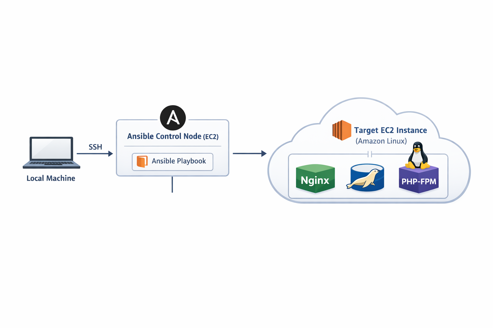
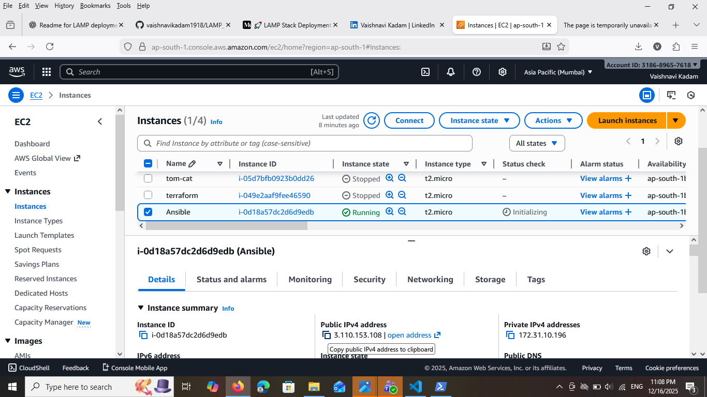
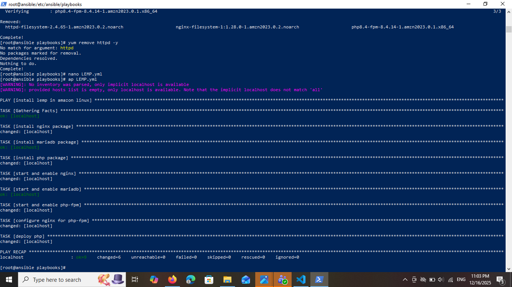
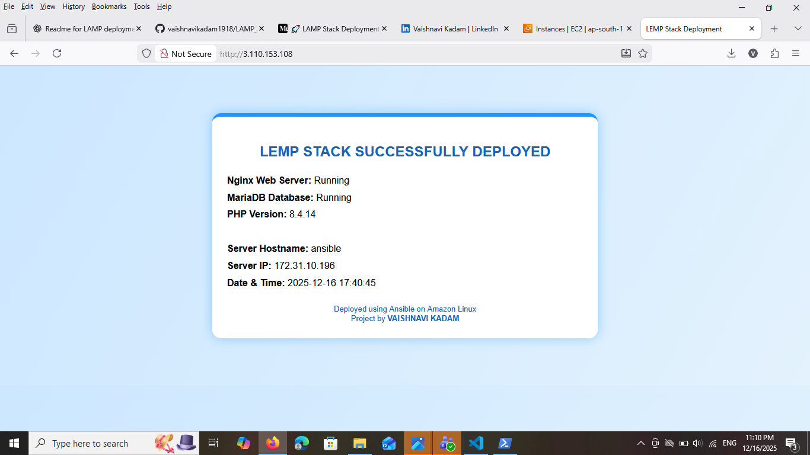

# 🚀 LEMP Stack Deployment on Amazon Linux Using Ansible

## 📌 Project Overview

This project demonstrates the automated deployment of a LEMP stack (Linux, Nginx, MariaDB, PHP-FPM) on an Amazon Linux EC2 instance using Ansible.

The entire setup — package installation, service management, Nginx–PHP configuration, and application deployment — is handled through a single Ansible playbook, following DevOps automation best practices.

## 🧰 Technologies Used

AWS EC2 (Amazon Linux 2 / Amazon Linux 2023)

Ansible (Configuration Management)

Nginx (Web Server)

MariaDB 10.5 (Database)3
PHP & PHP-FPM

Linux

## 🏗️ Architecture Diagram



```
Local Machine
     |
     | SSH
     v
Ansible Control Node (EC2)
     |
     | Ansible Playbook
     v
Target EC2 Instance (Amazon Linux)
     |
     |-- Nginx
     |-- MariaDB
     |-- PHP-FPM
```
## 📁 Project Structure
```
LEMP-Stack-Ansible/
├── lemp.yml
├── README.md
```
## ⚙️ Prerequisites
---
AWS EC2 instance (Amazon Linux)



SSH access to the instance

Security Group allowing:

22 (SSH)

80 (HTTP)

Ansible installed on the EC2 instance

## 📦 Ansible Playbook (lemp.yml)

```
The playbook performs the following actions:

Installs Nginx

Installs MariaDB server

Installs PHP, PHP-FPM, and MySQL PHP module

Starts and enables required services

Configures Nginx to work with PHP-FPM

Deploys a PHP application page
```


## ▶️ How to Run the Project
```
### 1️⃣ Install Ansible

        sudo dnf install ansible -y

### 2️⃣ Run the Playbook

        ansible-playbook lemp.yml
```


## ✅ Verification

After successful execution, open your browser and visit:
```
http://<EC2_PUBLIC_IP>
```
You should see a page displaying:

LEMP STACK SUCCESSFULLY DEPLOYED



Nginx running status

MariaDB running status

PHP version details

Server hostname and IP

## 🌟 Key Features

Fully automated LEMP deployment

Error-free Nginx + PHP-FPM configuration

Single playbook execution

Beginner-friendly DevOps project

Ideal for portfolio and learning
```
## 📌 Use Cases

DevOps hands-on practice

Web server automation

CI/CD base environment

Infrastructure as Code (IaC) learning

## 👩‍💻 Author

**Vaishnavi Kadam**

DevOps Engineer
